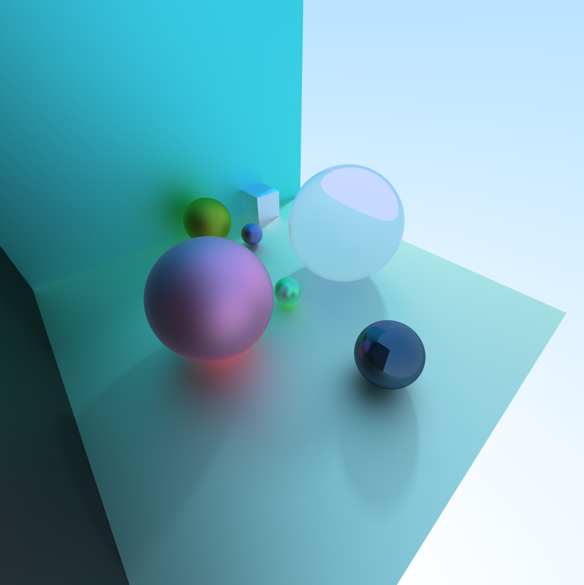
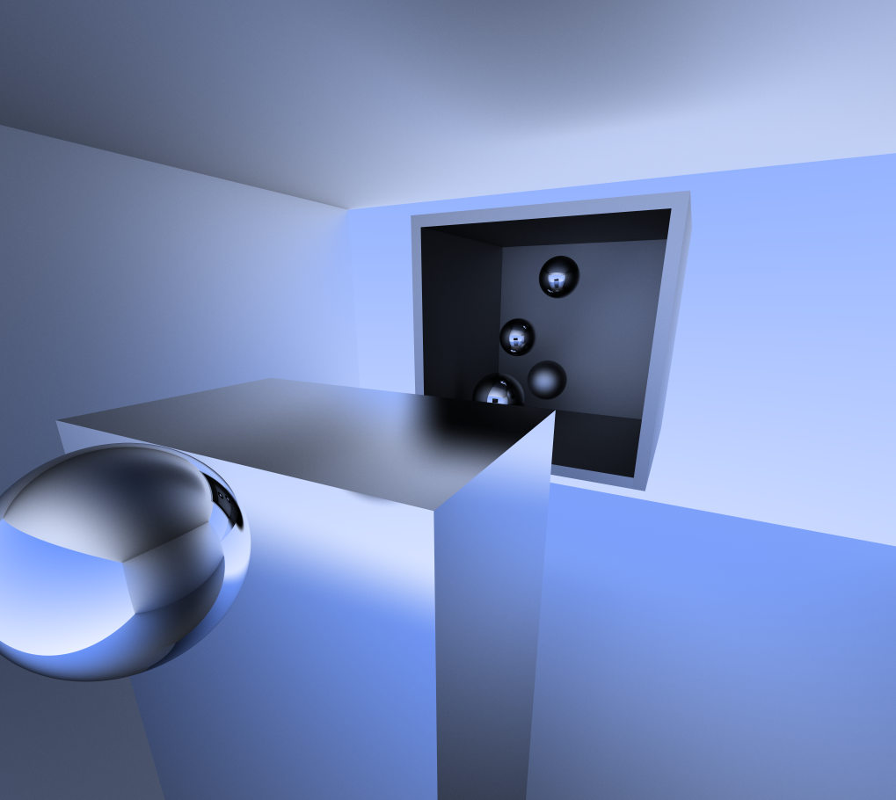
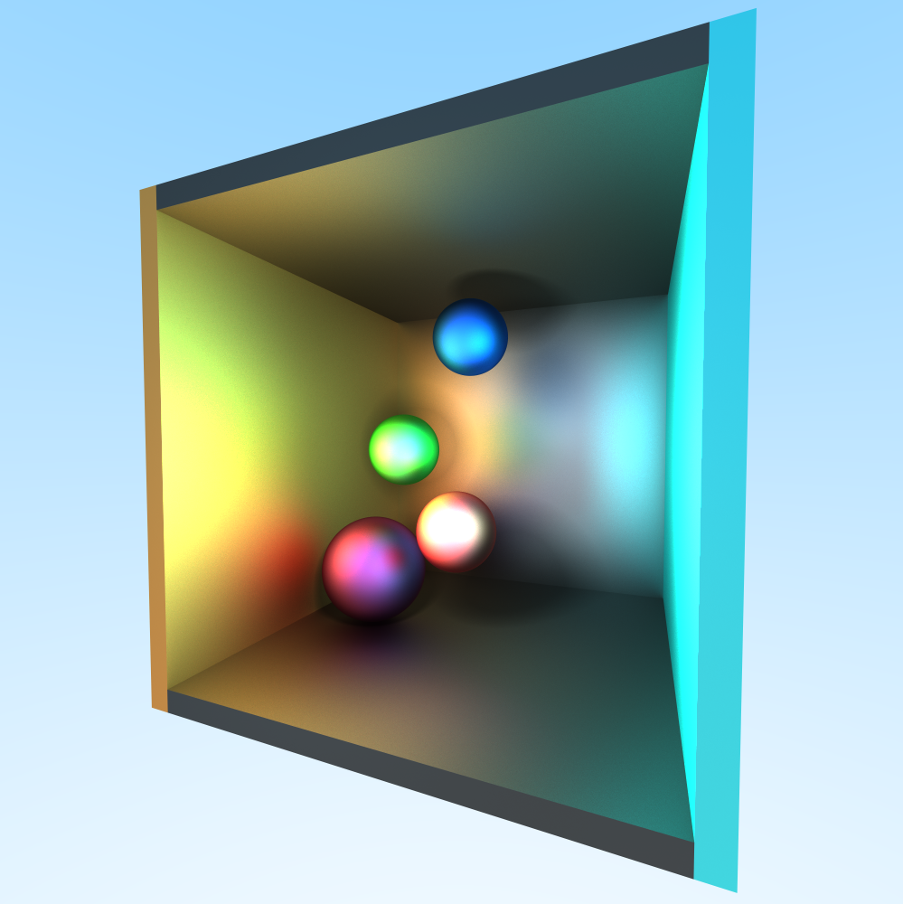
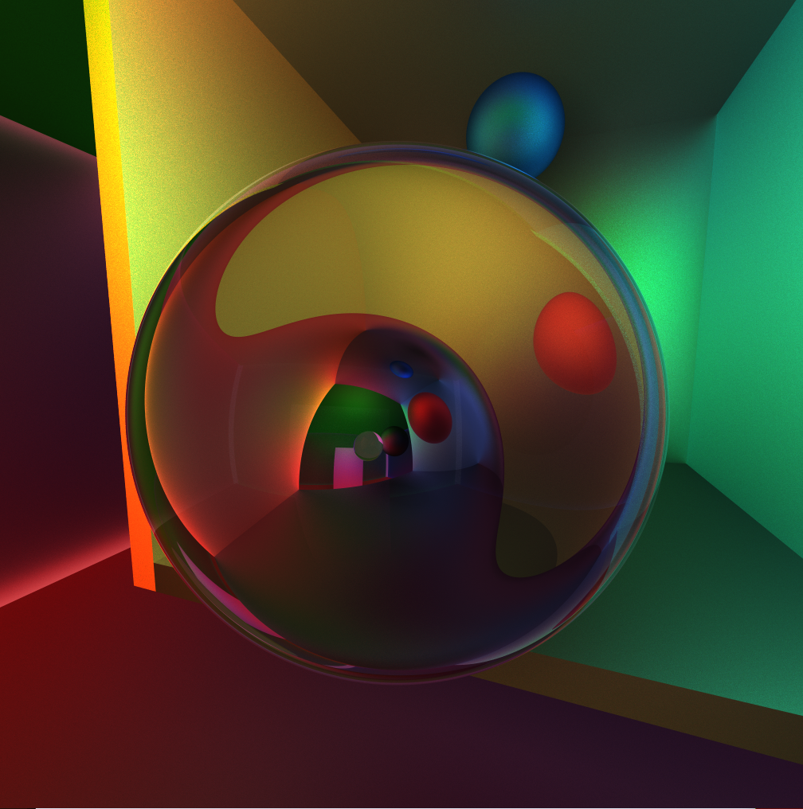
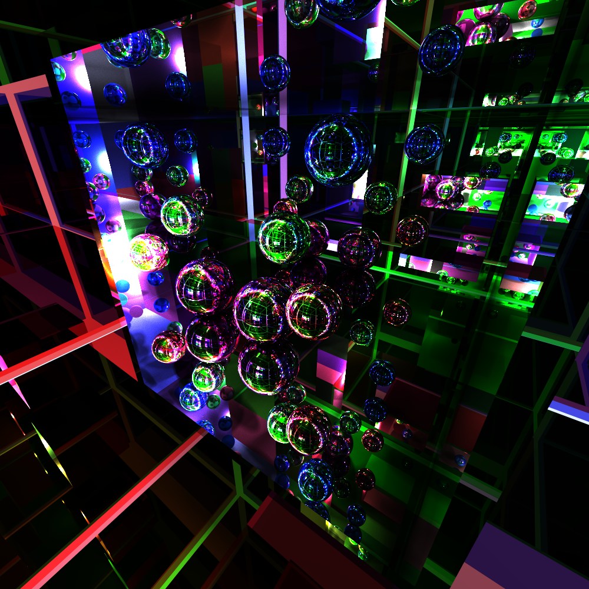

# 3D Ray Tracer

A real-time 3D ray tracer using OpenGL compute shaders. Goal was to accomplish as realistic as possible renders while maintaining it real-time.
Features:
 - Reflective, diffuse and dielectric materials. 
 - Differently colored spheres and cuboids. 
 - A controllable first person camera.
 - Soft and hard shadows.
 - Anti-aliasing.
 - Multiple differently colored source lights.
 
Light is reflected by taking the incoming vector, reflecting it as if the material was 100% reflective and mixing it with a random vector inside of a hemisphere at the intersection point. The material determines how much the random vector offsets the reflective vector.

